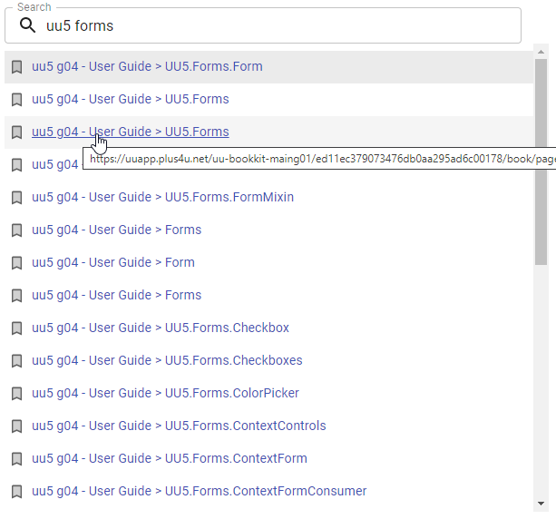

# uuGle

**uuGle** Chrome extension for fast and user friendly search in Unicorn bookkit and dockit books.


## Usage 

1. Install uuGle from [uuGle Chrome Web Store page](https://chrome.google.com/webstore/detail/uugle/makckafajckddaiinilmeogejgdmacmi)
1. **uuGle** automatically indexes every Unicorn bookkit book you open. Just open a single page of any book, and a list of all the pages
    in that book will be indexed and available for quick search anytime in the future.
   - **uuGle** indexes only **page title and book name** for searching, not whole page content (**uuGle** does not provide fulltext search).
   - It does not matter which specific page of book you open (home page is quite enough), all pages of the book you are permitted to are indexed. 
     
1. Type "*uu*" in search bar on any browser tab to switch to **uuGle** search in indexed books. Once in **uuGle** search mode, type any word from page or book title. Most relevant searches are being instantly suggested as you type.
    - You don't need to type whole word, search results are automatically expanded for you (e.g. type just "trans" and search results containing word "transaction" will be suggested).
    - Suggestions are sorted from the most relevant at the top.
    - For each suggestion you can see target book page URL.
1. Select suggestion and the corresponding book page will open in currently active browser tab.
   
### Alternative way of searching using uuGle UI
You can start searching using **uuGle UI** by clicking on the extension icon or using **keyboard shortcut** (*Ctrl+Shift+U* on Windows, *Ctrl+U* on Linux, *Command+U* on Mac).
This way, you take advantage of the standard Chrome search bar, like:
   - You can open any search results in **new browser tabs** using *Ctrl+click* (or *Ctrl+Enter*), which can come handy because there are often duplicate or similar page titles in bookkit books.
   - There are more search results being displayed (Chrome search bar results are limited to 12).
   - You can copy the address of the link in the search result (or anything you can do with a link on a regular web page).
     


## How it works

- Book pages index is permanently stored in the browser's [IndexedDB](https://developer.mozilla.org/en-US/docs/Web/API/IndexedDB_API) database. **uuGle** uses
[Elasticlunr.js](http://elasticlunr.com/) for fast and user friendly searching.
- Every indexed book is being re-indexed after some time once you open it again to keep uuGle index of pages up-to-date.

## Install extension
Install from [uuGle Chrome Web Store page](https://chrome.google.com/webstore/detail/uugle/makckafajckddaiinilmeogejgdmacmi)

## Constraints   
1. Only page title is being indexed. Fulltext content searching is not available.
1. Only english language fulltext search is supported.

## Road map
1. GUI to control book indexing - delete index, reindex single book etc.
1. Automatic pre-indexing of books from some online catalogue, so you don't need to open every book first individually to index it.  

# Development guide

<span style="color:red">Use the following lines for extension **development only**, you don't need to read it for regular extension usage.</span>  

# Chrome Extension Boilerplate with React 16.13 and Webpack 4

[](https://www.npmjs.com/package/chrome-extension-boilerplate-react)
[](https://www.npmjs.com/package/chrome-extension-boilerplate-react)
[](https://www.npmjs.com/package/chrome-extension-boilerplate-react)

[](https://david-dm.org/lxieyang/chrome-extension-boilerplate-react)
[](https://david-dm.org/lxieyang/chrome-extension-boilerplate-react?type=dev)

## Features

This is a basic Chrome Extensions boilerplate to help you write modular and modern Javascript code, load CSS easily and [automatic reload the browser on code changes](https://webpack.github.io/docs/webpack-dev-server.html#automatic-refresh).

This boilerplate is updated with:

- [React 16.13](https://reactjs.org)
- [Webpack 4](https://webpack.js.org/)
- [React Hot Loader](https://github.com/gaearon/react-hot-loader)
- [eslint-config-react-app](https://www.npmjs.com/package/eslint-config-react-app)
- [Prettier](https://prettier.io/)

This boilerplate is heavily inspired by and adapted from [https://github.com/samuelsimoes/chrome-extension-webpack-boilerplate](https://github.com/samuelsimoes/chrome-extension-webpack-boilerplate), with additional support for React 16.13 features and Webpack 4.

Please open up an issue to nudge me to keep the npm packages up-to-date. FYI, it takes time to make different packages with different versions work together nicely.

## Installing and Running

### Procedures:

1. Check if your [Node.js](https://nodejs.org/) version is >= **10.13**.
2. Clone this repository.
3. Change the package's `name`, `description`, and `repository` fields in `package.json`.
4. Change the name of your extension on `src/manifest.json`.
5. Run `npm install` to install the dependencies.
6. Run `npm start`
7. Load your extension on Chrome following:
   1. Access `chrome://extensions/`
   2. Check `Developer mode`
   3. Click on `Load unpacked extension`
   4. Select the `build` folder.
8. Happy hacking.

## Structure

All your extension's code must be placed in the `src` folder.

The boilerplate is already prepared to have a popup, an options page, a background page, and a new tab page (which replaces the new tab page of your browser). But feel free to customize these.

## Webpack auto-reload and HRM

To make your workflow much more efficient this boilerplate uses the [webpack server](https://webpack.github.io/docs/webpack-dev-server.html) to development (started with `npm start`) with auto reload feature that reloads the browser automatically every time that you save some file in your editor.

You can run the dev mode on other port if you want. Just specify the env var `port` like this:

```
$ PORT=6002 npm run start
```

## Content Scripts

Although this boilerplate uses the webpack dev server, it's also prepared to write all your bundles files on the disk at every code change, so you can point, on your extension manifest, to your bundles that you want to use as [content scripts](https://developer.chrome.com/extensions/content_scripts), but you need to exclude these entry points from hot reloading [(why?)](https://github.com/samuelsimoes/chrome-extension-webpack-boilerplate/issues/4#issuecomment-261788690). To do so you need to expose which entry points are content scripts on the `webpack.config.js` using the `chromeExtensionBoilerplate -> notHotReload` config. Look the example below.

Let's say that you want use the `myContentScript` entry point as content script, so on your `webpack.config.js` you will configure the entry point and exclude it from hot reloading, like this:

```js
{
  …
  entry: {
    myContentScript: "./src/js/myContentScript.js"
  },
  chromeExtensionBoilerplate: {
    notHotReload: ["myContentScript"]
  }
  …
}
```

and on your `src/manifest.json`:

```json
{
  "content_scripts": [
    {
      "matches": ["https://www.google.com/*"],
      "js": ["myContentScript.bundle.js"]
    }
  ]
}
```

## Intelligent Code Completion

Thanks to [@hudidit](https://github.com/lxieyang/chrome-extension-boilerplate-react/issues/4)'s kind suggestions, this boilerplate supports chrome-specific intelligent code completion using [@types/chrome](https://www.npmjs.com/package/@types/chrome). For example:


## Packing

After the development of your extension run the command

```
$ NODE_ENV=production npm run build
```

Now, the content of `build` folder will be the extension ready to be submitted to the Chrome Web Store. Just take a look at the [official guide](https://developer.chrome.com/webstore/publish) to more infos about publishing.

## Secrets

If you are developing an extension that talks with some API you probably are using different keys for testing and production. Is a good practice you not commit your secret keys and expose to anyone that have access to the repository.

To this task this boilerplate import the file `./secrets.<THE-NODE_ENV>.js` on your modules through the module named as `secrets`, so you can do things like this:

_./secrets.development.js_

```js
export default { key: '123' };
```

_./src/popup.js_

```js
import secrets from 'secrets';
ApiCall({ key: secrets.key });
```

:point_right: The files with name `secrets.*.js` already are ignored on the repository.

## Resources:

- [Webpack documentation](https://webpack.js.org/concepts/)
- [Chrome Extension documentation](https://developer.chrome.com/extensions/getstarted)

---

Michael Xieyang Liu | [Website](https://lxieyang.github.io)
